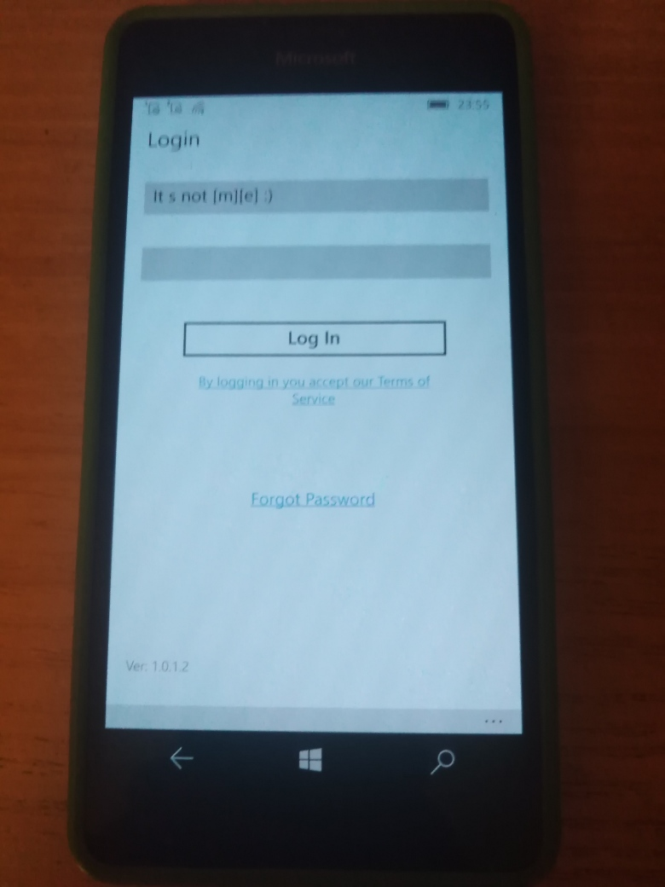

# InTouchApp v1.0.1.2 - master branch

## About
I have some plans to "recover" InTouchApp for Windows Phone. :)

So, this repo is my attempt to remake discontinued InTouchApp  WP8.1 app onto real UWP app. 

At now it's only early bird, draft UWP application (only "sketch" at now...)

## Photo of installed original app (sign up fail, Android device needed for advice)

## Tech/dev details
- Platforms: UWP only
- Targets: x64, x86, ARM
- OSes: Windows 10 (Mobile); 
- Min. Win. OS build: 15063

## Status / my 2 cents
- ForPDA decomp. completed but over 100500 bugs there ;
- Draft. Prototype / Build failed ;
- Work-in-progress .

## References
https://intouchapp.com/ official InTouchApp website 

## Licensing
MIT License

## ..
AS IS. No support. RnD only / DIY

## .
[m][e] December 2024
